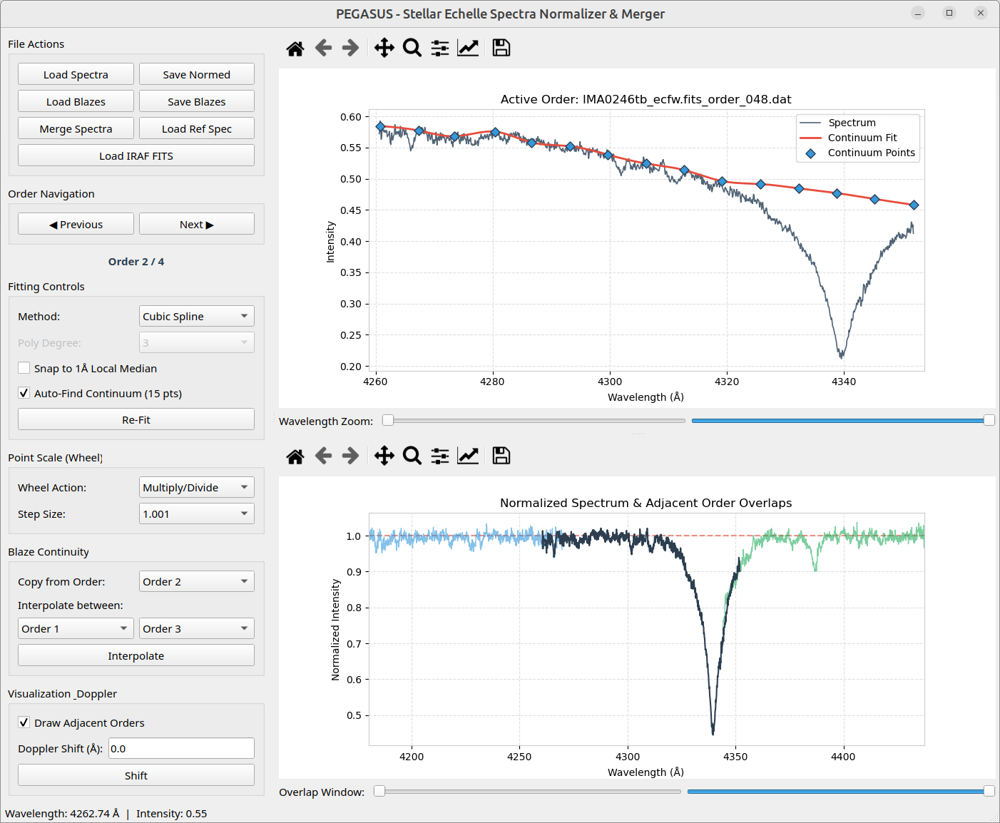
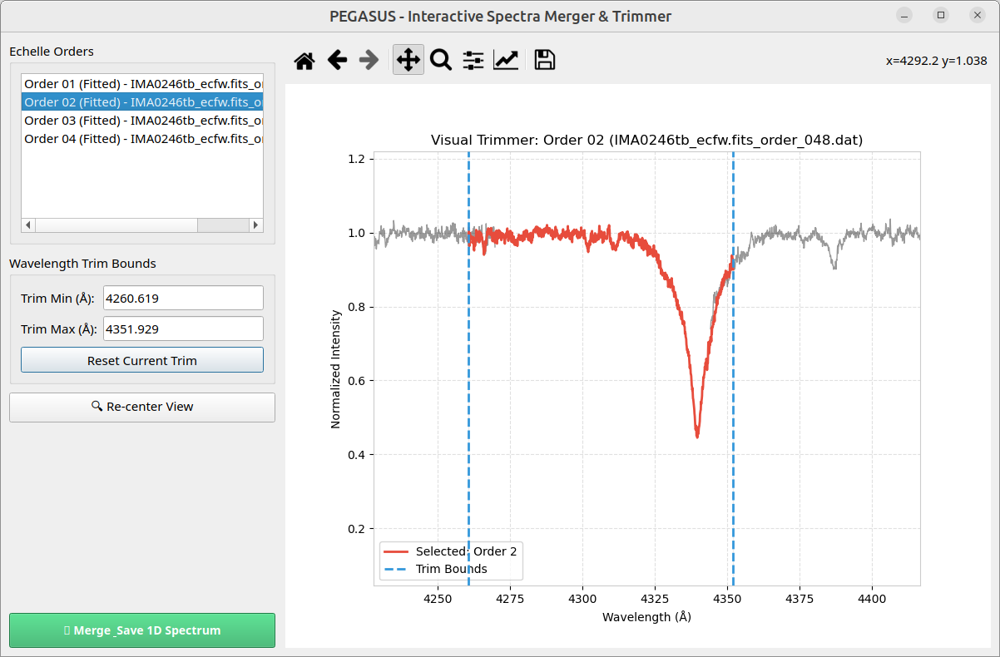

# PEGASUS
**PEGASUS** is a modern, high-performance, interactive visual tool written in Python and PyQt5 designed for reducing, normalizing, spline-fitting, and merging stellar echelle spectra. 

Inspired by the spectral reduction methodologies detailed in *"Spectroscopically resolving the Algol triple system"* (Kolbas et al.2015), PEGASUS consolidates legacy multi-window command workflows into a unified, highly interactive graphical dashboard.

---

## Screenshots

### Main Interface (Continuum Fitting & Overlap View)


### Spectra Merger & Interactive Visual Trimmer


---

## Table of Contents
1. [Screenshots](#screenshots)
2. [Acronym Expansion](#acronym-expansion)
3. [Prerequisites & Installation](#prerequisites--installation)
4. [Quick Start](#quick-start)
5. [Extensive Usage Guide](#extensive-usage-guide)
   - [File Loading and Sorting](#1-file-loading-and-sorting)
   - [Continuum Anchor Placement and Fitting](#2-continuum-anchor-placement-and-fitting)
   - [Advanced Continuum Manipulation (Mouse Wheel)](#3-advanced-continuum-manipulation-mouse-wheel)
   - [Continuum Snap-to-Median snapping](#4-continuum-snap-to-median-snapping)
   - [Blaze Continuity (Copying and Interpolation)](#5-blaze-continuity-copying-and-interpolation)
   - [Reference Spectrum and Doppler Shift Adjustments](#6-reference-spectrum-and-doppler-shift-adjustments)
   - [Saving and Loading Blaze Configurations](#7-saving-and-loading-blaze-configurations)
   - [Visual Trimming and Scientific Merging](#8-visual-trimming-and-scientific-merging)
6. [Keyboard and Mouse Reference](#keyboard-and-mouse-reference)
7. [Data Interoperability Details](#data-interoperability-details)
8. [License & Credits](#license--credits)

---

## Acronym Expansion

- **P**arametric
- **E**chelle
- **G**raphical
- **A**ssistant for
- **S**pectroscopic
- **U**nification and
- **S**pline-fitting

---

## Prerequisites & Installation

### Core Dependencies
PEGASUS is fully compatible with Python 3.8 to 3.12. Ensure you have the standard scientific Python libraries, PyQt5, and Astropy installed. 

Install the required packages in your active environment:
```bash
pip install pyqt5 matplotlib numpy scipy astropy
```

### Running PEGASUS
Navigate to your repository and execute:
```bash
python pegasus.py
```

---

## Quick Start

1. **Launch** `pegasus.py`.
2. Click **Load Spectra** and select your raw echelle orders.
3. Left-click on the top plot to place continuum anchor points.
4. Scale all points together using the **Mouse Wheel** to line up with the spectrum.
5. Navigate through the orders using **Next** and **Previous** buttons.
6. Click **Merge Spectra** to trim overlapping boundaries and combine them into a single 1D spectrum.

---

## Extensive Usage Guide

### 1. File Loading and Sorting
PEGASUS supports loading echelle orders in three main ways:
- **ASCII Order Files (Load Spectra)**: Parses plain-text files representing individual echelle orders. The files must contain two columns separated by spaces or tabs: Wavelength (in Å) and Intensity/Flux. Text headers are automatically skipped. Loaded orders are automatically sorted sequentially by increasing starting wavelength.
- **PolarBase `.s` Files (Load Spectra)**: Automatically parses multi-order ASCII spectra exported from the PolarBase archive (typically ESPaDOnS and Narval data).
  - *Automatic Metadata Skip*: Skips the first 2 metadata lines.
  - *Order Splitting*: Scans the single-stream file to detect order boundaries using negative wavelength jumps (`wavelength[i] < wavelength[i-1]`) and positive wavelength gaps (`wavelength[i] - wavelength[i-1] > 1.0 Å`), which correctly separates non-overlapping red-end segments.
  - *Unit Conversion*: Automatically converts wavelength values from nanometers (nm) to Angstroms (Å) by multiplying by 10.0.
- **Astronomical FITS Spectra (Load IRAF FITS)**: Automatically detects and parses four distinct spectrographic WCS formats:
  - *IRAF WAT2 multispec (2D/3D)*: Extracts data grids and WCS specifications from `WAT2_xxx` headers. Supports 2D grids (orders x pixels) and 3D data cubes (bands x orders x pixels, extracting Band 0).
  - *Log-Rebin coordinate/binSize*: Computes natural log-spaced grids ($\lambda_x = e^{\text{coordinate} + x \times \text{binSize}}$) using `coordinateXXX`/`binSizeXXX` headers.
  - *1D Linear Spectrum*: Generates coordinates using standard `CRVAL1`, `CDELT1`, and `CRPIX1` headers.
  - *FITS Binary Tables*: Automatically detects and extracts columns matching wavelength and flux/intensity.
  - *NaN Filtering*: Automatically strips out `NaN` values to ensure Cubic Spline stability.
  - *Automatic Redirection*: Selecting a `.fits` file through the ASCII "Load Spectra" dialog automatically routes it to the FITS parser.

### 2. Continuum Anchor Placement and Fitting
A crucial step in normalization is fitting the *blaze function* (continuum profile). PEGASUS offers two robust algorithms for this task:
- **Cubic Spline (Default)**: Best for complex instrument profiles that exhibit steep or non-polynomial instrument slopes. Requires at least 4 anchor points. If fewer points are placed, it falls back to Quadratic (3 points) or Linear (2 points) interpolation.
- **Polynomial**: Fits a polynomial curve to the anchors. Ideal for smooth, slowly-varying profiles.
  - *Polynomial Degree*: You can select degrees from 1 to 9.
  - *Mathematical Stability*: PEGASUS utilizes a centered wavelength model (subtracting the order's median wavelength $\lambda_{\text{mid}}$) to prevent computational overflow during high-order polynomial fits (an issue commonly found in raw fitting tools).
  - *Interactive Degree Tuning*: When using the Polynomial method, adding or removing points automatically scales the default polynomial degree to $N-1$ (up to degree 9) for rapid drafting.

### 3. Advanced Continuum Manipulation (Mouse Wheel)
Placing dozens of points on every order can be tedious. PEGASUS implements a **Mouse Scroll Wheel Scaling** feature that adjusts all continuum points on the active order simultaneously:
- **Multiply/Divide Mode (Default)**: Scrolling up multiplies all anchor $Y$-coordinates by the step size (e.g., `1.01` or `1.001`); scrolling down divides them. This acts as a scale multiplier, raising or lowering the entire continuum curve while preserving its fractional curvature.
- **Add/Remove Mode**: Scrolling up/down adds/subtracts a fixed constant value (e.g., `0.01` or `0.1`) to all anchors. This shifts the curve vertically without rescaling.
- *Tip*: Combine this with small step sizes (`1.001` or `0.01`) for ultra-fine adjustments to match your normalized continuum to $1.0$ exactly!

### 4. Continuum Snap-to-Median Snapping
In noisy spectra or orders with closely-packed absorption lines, manual cursor clicks can easily land in line cores, causing the continuum curve to sag. 
- To prevent this, toggle the **"Snap to 1Å Local Median"** checkbox.
- When enabled, any point you left-click to add, or any point you drag, will automatically snap its $Y$-coordinate to the **median intensity** of all raw spectrum pixels located inside a $\pm 0.5\text{ Å}$ wavelength window centered at the mouse cursor.
- This allows you to rapidly place points across absorption lines and remain confident that they align with the local envelope.

### 5. Automatic Continuum Finding (Auto-Find)
To bootstrap your continuum placement or analyze large datasets rapidly, you can toggle the **"Auto-Find Continuum (15 pts)"** checkbox under the Fitting Controls sidebar:
- **How it Works**: PEGASUS divides the active order into 15 equal bins. Within each bin, it applies a 21-pixel median filter to the raw spectrum (eliminating noise spikes and narrow absorption lines) and locates the peak intensity of the smoothed profile.
- **Strict Boundary Anchors**: To prevent Cubic Spline boundary overshoots, PEGASUS guarantees that at least one point is placed in the first 10 pixels (indices 0 to 9) and at least one point is in the last 10 pixels (indices `total_len - 10` to `total_len - 1`) of the order.
- **Fitting Default**: It automatically places 15 anchor points at these peaks and configures the fitting method to **Cubic Spline** by default, immediately drawing a smooth trace across the order.
- **Navigation Automation**: If you transition to another order (via Next/Previous navigation or file loading) while the checkbox is enabled, PEGASUS automatically generates 15 auto-find points for that new order if it doesn't already contain anchors, allowing automated pre-reduction of entire echelle datasets.

### 6. Blaze Continuity (Copying and Interpolation)
When processing sequential echelle orders, the instrument blaze function changes slowly. PEGASUS provides two shortcuts to copy continuum shapes across orders:
- **Copy from Order**: Select a source order in the dropdown. PEGASUS copies the point configuration, shifts it horizontally by the difference in starting wavelength $\Delta\lambda = \lambda_{\text{start, dest}} - \lambda_{\text{start, source}}$, and fits it to the new order.
- **Interpolate between Orders**: In cases where a single echelle order is heavily contaminated by a broad feature (such as the $H\alpha$ absorption profile) making continuum placement impossible, you can interpolate. Choose the previous order ($c1$) and the next order ($c2$). Click **Interpolate** to average their fitted continuum shapes (projected on normalized pixel coordinates `0.0` to `1.0` to preserve the blaze peak position) and project the interpolated curve onto the active order.

### 7. Automatic Y-Axis Scaling on Lower Plot
To prevent echelle orders from appearing vertically squished and to make fine absorption/emission lines easy to inspect, the lower normalized spectrum screen (`draw_overlap`) automatically adjusts its Y-axis:
- **Tight Autoscale**: The Y-limits automatically scale to fit the active order's normalized data range tightly, applying a 5% margin (for example, displaying `[0.86, 1.02]` for a high-signal order).
- **Default [0.0, 1.1] Limits**: Falls back to `[0.0, 1.1]` if the active order has not yet been fitted.
- **Reference Spectrum & Doppler Shift**: Click **Load Ref Spec** to overlay a synthetic model in the bottom panel. Enter a shift in the **Doppler Shift (Å)** text box and click **Shift** to slide it horizontally to verify your normalization.

### 8. Saving and Loading Blaze Configurations
Your work is fully restorable.
- **Save Blazes**: Exports all your picked continuum anchor coordinates into a plain-text database. The format matches legacy Java logs perfectly:
  1. Total number of orders.
  2. A list of anchor point counts for each order.
  3. All space-separated $(X, Y)$ anchor coordinates in sequence.
- **Load Blazes**: Re-imports a saved blaze database, immediately re-populating all anchor points and re-generating their spline/polynomial fits.

### 9. Visual Trimming and Scientific Merging
Echelle spectra suffer from low signal-to-noise ratios (SNR) and severe instrument roll-off at the overlapping edges of each order. Directly merging raw orders creates jagged, overlapping spikes. PEGASUS solves this with an interactive visual trimmer:
- Click **Merge Spectra** to launch the resizable trimmer workspace dialog.
- **Draggable Bounds & Dynamic Masking**: Hovering over the blue dashed vertical boundary lines changes the mouse cursor to a double-sided arrow (`Qt.SizeHorCursor`). Drag them to narrow the active wavelength range. Discarded edge data is visually shaded with a translucent gray overlay.
- **Plot Enhancements**: Plotted non-active orders appear in faint black (`color='#000000', alpha=0.4`) instead of light gray, staying clearly visible in the background. The dialog default viewport limits are set to `[0.0, 1.1]`.
- **Scientific Re-Gridding and Combining**:
  1. Once all orders have been trimmed, click **Merge & Save 1D Spectrum**.
  2. PEGASUS automatically calculates the optimal unified pixel bin spacing $\Delta\lambda$ based on the average resolution of your spectral segments.
  3. It generates a uniform, target wavelength grid.
  4. For every wavelength bin, PEGASUS performs a **robust median combine** of all overlapping pixel intensities. Taking the median successfully rejects outliers like cosmic ray hits, telluric spikes, and remnant edge roll-offs.
  5. Any rare physical gaps are safely reconstructed using linear interpolation.
  6. The finalized merged 1D spectrum is exported as a clean two-column ASCII file.

---


## Keyboard and Mouse Reference

### Top Fitting Canvas
- **Left-Click (Empty space)**: Add a new continuum anchor point.
- **Left-Click & Drag (On point)**: Smoothly drag and reposition the anchor point.
- **Right or Middle-Click (On point)**: Delete the anchor point.
- **Scroll Wheel**: Vertically scale or shift all anchors in the active order.

### Visual Trimmer Canvas (Popup Dialog)
- **Hover near boundary line**: Cursor changes to `SizeHorCursor`.
- **Left-Click & Drag boundary line**: Interactively adjust the `Trim Min` and `Trim Max` wavelength cutoffs.

---

## Data Interoperability Details

- **Normalized Spectrum Save**: Click **Save Normed** to select an export folder. PEGASUS saves each fitted order under `[original_name]-norm.[ext]`. The output contains two tab-separated columns:
  $$\lambda \quad \left(\frac{I_{\text{raw}}}{I_{\text{fit}}}\right)$$
- **Output Compatibility**: The exported files are fully compatible with standard astronomical software such as IRAF, PyRAF, and spectroscopy analysis routines.

---

## License & Credits
PEGASUS is designed and maintained as an open-source tool for astronomical echelle spectroscopy. It is inspired by the spectral reduction algorithms of the Kolbas et al. Algol triple system paper.
