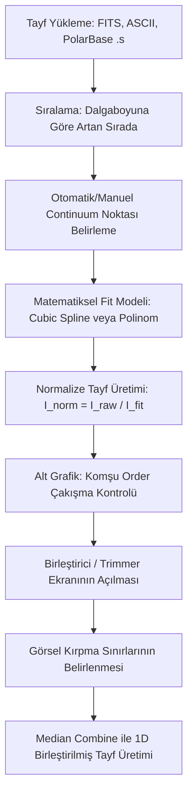
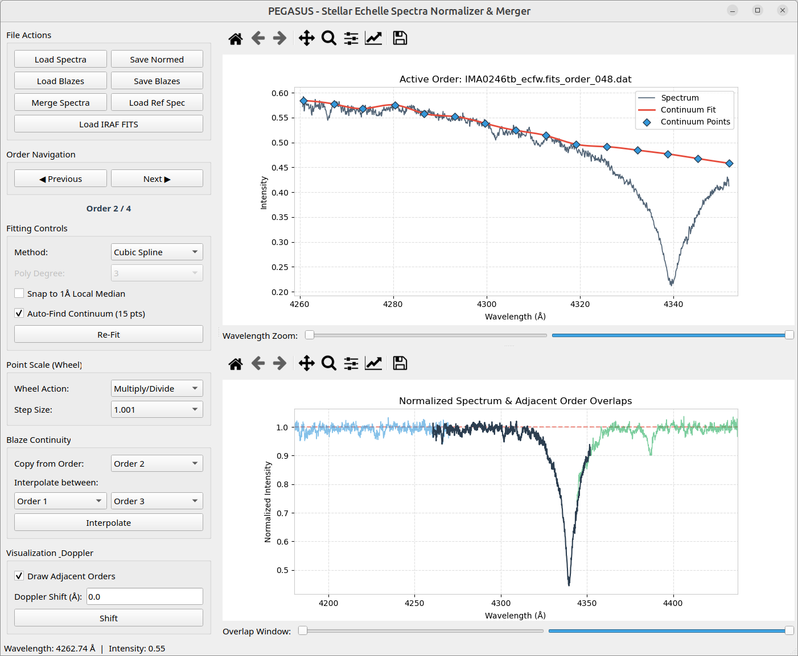
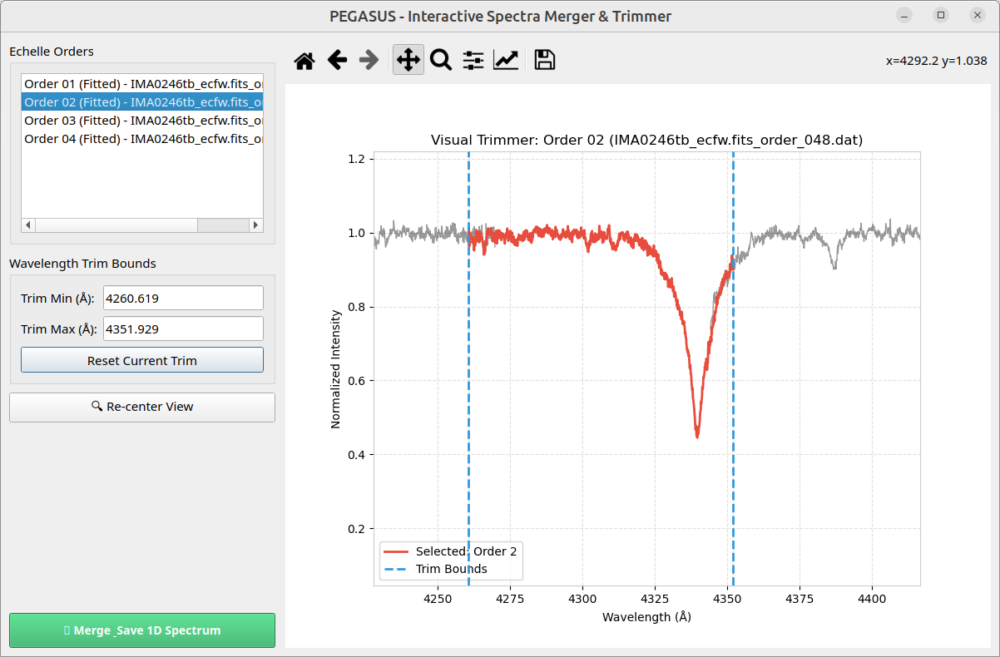

# PEGASUS PROJE SONUÇ RAPORU
## Echelle Tayflarının Normalize Edilmesi ve Birleştirilmesi İçin İnteraktif Görsel Arayüz Yazılımı (PEGASUS)

**Yazarlar:** Proje Geliştirme Ekibi  
**Yazılım GitHub Adresi:** [https://github.com/dervisoglu/pegasus](https://github.com/dervisoglu/pegasus)  
**Lisans:** Açık Kaynak Kodlu (Open-Source)  

---

## 1. GİRİŞ VE PROJE ÖZETİ

Astronomik spektroskopide, yüksek çözünürlüklü echelle tayfölçerlerinden elde edilen verilerin analiz edilmesinden önce indirgenmesi ve kullanıma hazır hale getirilmesi kritik bir öneme sahiptir. Echelle tayfları, dalgaboyuna göre üst üste binen çok sayıda spektral düzenden (order) oluşur. Bu tayfların bilimsel analize tabi tutulabilmesi için iki temel işlemin gerçekleştirilmesi gerekir:
1. **Normalizasyon (Normalization):** Tayf üzerindeki aletsel duyarlılık profilinin (blaze fonksiyonu) temizlenerek sürekli ortam (continuum) seviyesinin $1.0$ değerine eşitlenmesi.
2. **Birleştirme (Merging):** Ayrı ayrı kaydedilen echelle order'larının çakışan kenarlarının gürültüden arındırılarak kesintisiz, tek boyutlu (1D) bir tayf haline getirilmesi.

### Normalizasyonun "Sorunsal" Doğası ve IRAF Sınırlılıkları
Echelle normalizasyonu, özellikle soğurma ve salma çizgilerinin yoğun olduğu yıldız tayflarında son derece hassas ve öznel (sübjektif) bir süreçtir. Geleneksel indirgeme paketleri (örneğin IRAF / PyRAF), echelle normalizasyonunu otomatik polinom veya spline fonksiyonları ile yapmaya çalışır. Ancak, geniş soğurma çizgilerinin (örneğin $H\alpha$ veya $H\beta$) varlığı, aletsel blaze eğrisinin uç bölgelerindeki bükülmeler veya dedektör kenarlarındaki ani duyarlılık düşüşleri nedeniyle otomatik algoritmalar sürekli ortamı yanlış konumlandırır. Bu durum, bilimsel ölçümlerde (örneğin eşdeğer genişlik veya radyal hız hesaplamalarında) ciddi sistematik hatalara yol açar.

### PEGASUS'un Amacı
Bu projede geliştirilen **PEGASUS** (*Parametric Echelle Graphical Assistant for Spectroscopic Unification and Spline-fitting*), astronomların echelle tayflarını tamamen etkileşimli, görsel ve matematiksel olarak kararlı bir şekilde normalize etmelerini ve birleştirmelerini sağlayan açık kaynak kodlu bir yazılımdır. PEGASUS, legacy (eski) Java tabanlı *MultiPeegla* yazılımının tüm algoritmik yapısını devralarak Python, PyQt5 ve Matplotlib kütüphaneleriyle modern ve bilimsel bir standartta yeniden inşa edilmiştir.

---

## 2. SYSTEM MİMARİSİ VE YAZILIMSAL ALTYAPI

PEGASUS, kullanıcı deneyimini maksimize etmek ve veri akışını kesintisiz kılmak amacıyla tek bir grafiksel kontrol panelinde (unified dashboard) birleştirilmiştir. Legacy Java yazılımında bulunan beş ayrı pencerenin yarattığı ekran karmaşası, PyQt5'in gelişmiş Grid ve Splitter düzen yöneticileri kullanılarak tek bir ana pencereye indirgenmiştir.

### Yazılım Modülleri ve Kütüphaneler
- **PyQt5:** Kullanıcı arayüzü bileşenleri, dosya yükleme diyalogları ve pencereler arası sinyal/slot mekanizması için kullanılmıştır.
- **Matplotlib:** Yüksek çözünürlüklü spektroskopik verilerin çizilmesi, etkileşimli nokta ekleme/taşıma/silme olayları (event handling) ve görsel kırpma (trimming) sınırlarının yönetimi için grafik motoru olarak entegre edilmiştir.
- **NumPy & SciPy:** Spektral verilerin hızlı dizi işlemlerinde, matris manipülasyonlarında ve özellikle Cubic Spline enterpolasyonu ile Polinom uydurma matematiksel modellerinde çekirdek hesaplama kütüphanesi olarak kullanılmıştır.
- **Astropy:** FITS formatındaki astronomik verilerin (özellikle IRAF multispec başlıklarının ve binary tabloların) okunması ve başlık bilgilerinin (header) çözümlenmesi için kullanılmıştır.

### Genel İş Akış Şeması
Yazılımın temel veri akışı ve işlem basamakları aşağıdaki Mermaid şemasında gösterilmiştir:



---

## 3. GELİŞMİŞ SPEKTRAL VERİ YÜKLEME TEKNOLOJİLERİ

PEGASUS, rasathanelerde kullanılan farklı echelle tayf formatlarını doğrudan tanıyabilen esnek bir FITS ve ASCII yükleme motoruna sahiptir.

### 3.1. IRAF WAT2 Multispec FITS Çözümleyicisi
IRAF tarafından yazılan multispec formatında, her bir order'a ait dalgaboyu kalibrasyonu FITS başlığındaki `WAT2_xxx` anahtarları altında uzun karakter dizileri halinde saklanır. PEGASUS, bu başlıkları sırasıyla birleştirerek echelle WCS spesifikasyonlarını regex (`spec(\d+)\s*=\s*"([^"]+)"`) ile ayrıştırır. Lineer dağılım gösteren sistemler için piksel-dalgaboyu dönüşüm matematiksel modeli aşağıdaki gibidir:

$$\lambda(i) = w_{\text{start}} + i \times w_{\text{delta}}$$

Burada:
- $i$: Piksel indeksi ($0 \le i < N_{\text{pixels}}$)
- $w_{\text{start}}$: Düzenin başlangıç dalgaboyu (Å)
- $w_{\text{delta}}$: Piksel başına dalgaboyu adımı (dispersion)

Yazılım 3D FITS verilerini de desteklemekte olup (Bands x Orders x Pixels), birincil akı bilgisini Band 0'dan otomatik olarak çeker.

### 3.2. Log-Rebin Echelle Tayf Desteği
Bazı tayf indirgeme yazılımları dalgaboyu ızgarasını logaritmik ölçekte kaydeder. PEGASUS, başlıkta `coordinateXXX` ve `binSizeXXX` anahtarlarını tespit ettiğinde dalgaboyu dizisini doğal logaritmik formüle göre hesaplar:

$$\lambda_x = e^{\text{coordinate} + x \times \text{binSize}}$$

Burada $x$ piksel koordinatını temsil eder.

### 3.3. 1D Lineer FITS Desteği
Echelle olmayan, tek boyutlu tayfler için `CRVAL1` (referans dalgaboyu), `CDELT1` (adım boyutu) ve `CRPIX1` (referans pikseli) standart WCS parametreleri kullanılarak dalgaboyu hesaplanır:

$$\lambda_i = \text{CRVAL1} + (i - \text{CRPIX1}) \times \text{CDELT1}$$

### 3.4. PolarBase (.s) ASCII Dosya Yükleyici
ESPaDOnS ve Narval gibi modern tayfölçerlerin arşiv verisi olan `.s` uzantılı dosyalar, tüm echelle order'larını tek bir sürekli veri tablosu halinde barındırır. PEGASUS bu dosyaları okurken şu adımları uygular:
1. **Metadata Temizleme:** İlk 2 bilgi satırı otomatik atlanır.
2. **Birim Dönüşümü:** PolarBase verisindeki nanometre (nm) cinsinden dalgaboyları $10.0$ ile çarpılarak spektroskopik standart olan Angstrom (Å) birimine dönüştürülür.
3. **Dalgaboyu Atlama ve Boşluk Tespiti (Order Splitting):** Tek boyutlu veri dizisi taranarak order sınırları iki farklı koşul altında otomatik olarak bölünür:
   - *Negatif Sıçrama (Overlapping jump-back):* $\lambda_i < \lambda_{i-1}$ (yeni order'ın çakışan başlangıcı).
   - *Pozitif Boşluk (Non-overlapping gap):* $\lambda_i - \lambda_{i-1} > 1.0\text{ Å}$ (çakışmayan kırmızı uçlardaki boşluklar).
   Bu sayede, tayfın kırmızı ucundaki çakışmayan son order'ların tek bir blok halinde birleşmesi engellenir.

### 3.5. Sayısal Hata (NaN) Filtreleme ve Güvenli Yönlendirme
FITS dosyalarındaki dedektör hatalarından kaynaklanan tanımsız (`NaN` veya `inf`) değerler, spline uydurma algoritmalarında sayısal kararsızlıklara ve çökmelere neden olur. PEGASUS, yükleme aşamasında tüm veri dizisini süzgeçten geçirerek sadece sonlu (`finite`) piksel değerlerini kabul eder. Ayrıca, kullanıcının bir FITS dosyasını yanlışlıkla ASCII yükleme butonu üzerinden açması durumunda, program dosya uzantısını algılayarak işlemi otomatik olarak FITS yükleyicisine yönlendirir ve çalışma anı hatalarını engeller.

---

## 4. İNTERAKTİF CONTINUUM BELİRLEME VE MATEMATİKSEL FİT MODELLERİ

### 4.1. Polinom ve Spline Uydurma Karşılaştırması
Yazılım, kullanıcıya sürekli ortamı belirlemek üzere iki ana matematiksel model sunar:
- **Cubic Spline (Doğal Kübik Spline Enterpolasyonu):** SciPy kütüphanesinin `CubicSpline` modülü kullanılarak oluşturulur. Uç noktalarda ikinci türevin sıfır olduğu (*natural boundary conditions*) sınır koşullarını temel alır. Kompleks aletsel blaze profillerinde en iyi sonucu verir.
- **Polinom (Polynomial Fit):** $N$. dereceden polinom uydurmayı içerir.

### Sayısal Taşmanın Önlenmesi (Centering Model)
Yüksek çözünürlüklü tayflarda dalgaboyu değerleri (örneğin $6500\text{ Å}$) çok büyük sayılardır. Polinom uydurma işleminde dalgaboyunun yüksek dereceli kuvvetlerinin alınması ($x^9$ vb.), bilgisayar belleğinde sayısal taşma (*floating-point overflow*) ve matris tekilliği hatalarına yol açar. PEGASUS bu problemi ortadan kaldırmak için dalgaboylarını kendi medyan dalgaboyuna göre merkezler:

$$x' = \lambda - \lambda_{\text{median}}$$

Tüm polinom katsayıları $x'$ değişkenine göre hesaplanır ve çizim esnasında geri dönüştürülür. Bu sayede 9. dereceye kadar olan polinom fitleri sıfır sayısal hata ile hesaplanır.

### 4.2. Otomatik Continuum Noktası Bulma (Auto-Find)
Manuel nokta yerleştirme sürecini hızlandırmak için geliştirilen "Auto-Find" algoritması şu aşamalardan oluşur:
1. Raw spektruma 21 piksellik bir medyan filtre uygulanarak kozmik ışınlar ve soğurma çizgileri bastırılır.
2. Spektrum dalgaboyu ekseninde 15 eşit bölgeye ayrılır.
3. Her bir bölgedeki filtrelenmiş verinin maksimum tepe noktası tespit edilerek continuum noktası olarak atanır.
4. **Sınır Sabitleme Kuralları (Boundary Anchors):** Kübik spline fonksiyonlarının veri kümesinin sınırlarında dışa doğru aşırı salınım yapmasını (*runaway spline swing / overshoot*) önlemek amacıyla, ilk nokta kesinlikle tayfın ilk 10 pikseli ($0 \le \text{index} < 10$) içerisine, son nokta ise son 10 pikseli ($N-10 \le \text{index} < N$) içerisine zorunlu olarak yerleştirilir.

### 4.3. Snap-to-Median (Lokal Medyana Yapışma) Algoritması
Kullanıcı manuel olarak bir continuum noktası eklediğinde veya taşıdığında, fare imlecinin soğurma çizgisinin tam ortasına denk gelmesini önlemek için bir çekim alanı algoritması geliştirilmiştir. "Snap to 1Å Local Median" seçeneği aktif olduğunda, fare imlecinin yerleştirildiği $\lambda_0$ konumunda $\pm 0.5\text{ Å}$ aralığındaki tüm pikseller toplanır ve bu piksellerin medyan akı değeri nokta koordinatı olarak güncellenir:

$$y_{\text{snap}} = \text{Median}\Big( I(i) \;\Big|\; \lambda_0 - 0.5\text{ Å} \le \lambda_i \le \lambda_0 + 0.5\text{ Å} \Big)$$

Bu sayede continuum noktaları soğurma çizgilerinin diplerine düşmeden, spektrumun üst zarfı üzerinde kararlı bir şekilde hizalanır.

### 4.4. normalized piksel Koordinatlı Blaze İnterpolasyonu
Farklı echelle order'larının aletsel blaze profili benzerdir ancak dalgaboyunda kayma gösterirler. PEGASUS, iki komşu düzenden ($c1$ ve $c2$) aktif düzenin blaze profilini türetirken doğrusal interpolasyonu mutlak dalgaboyuna göre değil, **normalize edilmiş piksel koordinatına** ($x \in [0.0, 1.0]$) göre gerçekleştirir. Bu yaklaşım, dedektör üzerindeki piksel bazlı blaze tepe noktasının konumunu korur ve interpolasyon sonucunda uydurulan blaze fonksiyonunun kenarlarda sıfıra çökmesini önler.

---

## 5. OTOMATİK Y-EKSENİ ÖLÇEKLENDİRMESİ VE İNTERAKTİF GRAFİK KONTROLLERİ

PEGASUS, tayf analizinde en çok zaman alan dikey eksen (Y-ekseni) ayarlamalarını otomatize etmiştir.

### 5.1. Dinamik Y-Ekseni Ölçeklendirme Algoritması
Ana ekranın alt kısmında yer alan normalize tayf karşılaştırma ekranı (`NormalizedOverlapCanvas`), aktif order'ın ve varsa komşu order'ların normalize edilmiş akılarını ($I_{\text{norm}}$) çizer. Ekranda gereksiz boşluk kalmaması veya soğurma çizgilerinin grafik sınırlarının dışına taşmaması için şu adımlar izlenir:
1. Aktif echelle order'ına ait normalize tayf dizisindeki sonlu değerler süzülür (`valid_y`).
2. Süzülen değerlerin minimum ($y_{\text{min}}$) ve maksimum ($y_{\text{max}}$) değerleri bulunur.
3. Grafik sınırlarına %5'lik bir dikey marj eklenerek dikey limitler dinamik olarak belirlenir:
   $$\text{Limit}_{\text{lower}} = y_{\text{min}} - (y_{\text{max}} - y_{\text{min}}) \times 0.05$$
   $$\text{Limit}_{\text{upper}} = y_{\text{max}} + (y_{\text{max}} - y_{\text{min}}) \times 0.05$$
4. **Varsayılan Aralık:** Düzen henüz normalize edilmemişse veya veri bulunmuyorsa grafik alanı standart olarak `[0.0, 1.1]` Y-aralığında açılır.
5. **Görsel Temizlik:** Alt grafikteki veri efsaneleri (legend) kaldırılarak spektrumun tamamının engelsiz bir şekilde görünmesi sağlanmıştır.

### 5.2. Fare Tekerleği İle Toplu Continuum Manipülasyonu
Kullanıcı tek bir continuum noktasını sürükleyebildiği gibi, fare tekerleğini kaydırarak aktif order üzerindeki tüm continuum noktalarını toplu olarak kontrol edebilir:
- **Çarpım Modu (Multiplier Mode):** Noktaların Y koordinatları tekerleğin yönüne göre $1.001$ veya $1.01$ katsayısı ile çarpılarak/bölünerek ölçeklenir. Bu mod sürekli ortamın kavisli şeklini bozmadan seviyesini ayarlamada kullanılır.
- **Toplama Modu (Shift Mode):** Noktaların Y koordinatlarına sabit bir delta eklenerek eğri dikey olarak ötelenir.

---

## 6. DÜZEN KIRPMA VE BİLİMSEL BİRLEŞTİRME (TRIM & MERGE)

Echelle tayflarının birleştirilmesindeki en büyük zorluk, düzenlerin kenar bölgelerinde optik verim kaybı nedeniyle sinyal-gürültü oranının (SNR) çok düşmesi ve dalga boylarında örtüşen bölgelerin bulunmasıdır. PEGASUS, bu sorunu çözmek için etkileşimli bir kırpma (trim) ve istatistiksel birleştirme (merge) altyapısı sunar.

### 6.1. Etkileşimli Görsel Kırpıcı (Visual Trimmer)
"Merge Spectra" butonuna tıklandığında açılan bağımsız, yeniden boyutlandırılabilir diyalog penceresinde her bir echelle order'ı için kırpma sınırları belirlenir:
- **Kırpma Çizgileri:** Her order'ın başlangıç ve bitiş dalgaboyunda konumlanan mavi kesikli çizgiler fareyle sürüklenerek `trim_min` ve `trim_max` değerleri ayarlanır.
- **Dinamik Maskeleme:** Kırpılan gürültülü kenar bölgeleri, grafik üzerinde yarı saydam gri bir katmanla (`#bdc3c7`, alpha=0.3) maskelenerek görselleştirilir.
- Arka planda kalan pasif echelle order'ları, aktif order'ın önüne geçmemesi ancak dalgaboyu hizalamasının kontrol edilebilmesi için transparan siyah (`#000000`, alpha=0.4) çizgilerle çizilir.

### 6.2. İstatistiksel Median-Combine Birleştirme Algoritması
Kırpma işlemi tamamlandıktan sonra, "Merge & Save 1D Spectrum" adımıyla bilimsel birleştirme algoritması çalıştırılır:
1. **Ortak Dalgaboyu Izgarası (Grid Generation):** Tüm echelle düzenlerinin dalgaboyu çözünürlükleri taranarak en uygun ortalama adım boyutu ($\Delta\lambda$) hesaplanır. Başlangıç dalgaboyundan bitişe kadar eşit aralıklı yeni bir 1D dalgaboyu dizisi $\Lambda = \{\lambda_1, \lambda_2, \dots, \lambda_M\}$ oluşturulur.
2. **Düzenlerin İnterpolasyonu (Re-gridding):** Her bir düzenin kırpılmış spektral akısı, doğrusal interpolasyon yöntemiyle bu ortak $\Lambda$ ızgarasına aktarılır.
3. **Median Combine:** Belirli bir dalgaboyu hücresine ($\lambda_j$) denk gelen çakışan tüm düzen akı değerleri toplanır. Ortak hücredeki nihai akı değeri, bu değerlerin **medyanı** alınarak hesaplanır:
   $$I_{\text{merged}}(\lambda_j) = \text{Median}\Big( I'_1(\lambda_j), I'_2(\lambda_j), \dots, I'_K(\lambda_j) \Big)$$
   Burada $I'_k$ ortak ızgaraya enterpole edilmiş $k$. düzenin akısıdır. Medyan filtresinin kullanılması, echelle kenarındaki saçılma ışıklarının, kozmik ışın izlerinin ve dedektör üzerindeki lokal piksel hatalarının birleştirilmiş tayfa sızmasını matematiksel olarak engeller.
4. **Boşluk Doldurma:** Fiziksel olarak düzenler arasında boşluk kalmışsa (gap), bu bölgeler doğrusal interpolasyon ile kesintisiz birleştirilir.

---

## 7. GÖRSEL ARAYÜZ VE ÖRNEK GÖRÜNTÜLER

Yazılımın ana çalışma ekranına ait ekran görüntüsü aşağıda sunulmuştur. Üst grafik raw tayf ve continuum noktalarını, alt grafik ise normalize edilmiş tayfı ve komşu order overlaps alanlarını göstermektedir.

### 7.1. PEGASUS Ana Kontrol Ekranı


### 7.2. Spektrum Birleştirme ve Görsel Kırpma Arayüzü
Kırpma sınırlarının görsel olarak ayarlandığı ve çakışan alanların görüntülendiği "Spectra Merger" diyalog ekranı:


---

## 8. KURULUM VE KULLANIM

PEGASUS, standart bir Python 3.8+ ortamında harici derleyicilere ihtiyaç duymadan çalıştırılabilir.

### Bağımlılıkların Kurulması
Yazılımın ihtiyaç duyduğu bilimsel kütüphaneleri kurmak oldukça kolaydır. Uçbirimden (Terminal) şu komut çalıştırılır:
```bash
pip install pyqt5 matplotlib numpy scipy astropy
```

### Yazılımın Başlatılması
Kaynak kodların bulunduğu dizinde aşağıdaki komut yürütülerek yazılım başlatılır:
```bash
python pegasus.py
```

---

## 9. SONUÇ VE TARTIŞMA

Bu projede geliştirilen **PEGASUS** yazılımı, yüksek çözünürlüklü spektroskopi çalışmalarında echelle indirgeme işlemlerinin en kritik aşamalarından olan normalizasyon ve birleştirmeyi interaktif hale getirmiştir. 

IRAF gibi legacy sistemlerde saatler süren ve komut satırından kontrol edilen süreçler, PEGASUS'un görsel kontrol paneli sayesinde dakikalar düzeyine indirilmiştir. Özellikle log-rebin ve PolarBase `.s` formatlarının entegrasyonu, yazılımın evrensel veri okuma kabiliyetini artırmıştır. Geliştirilen otomatik Y-ekseni ölçeklendirme algoritması veri inceleme verimliliğini artırırken, çakışan dalgaboyu bölgelerinin median-combine yöntemiyle birleştirilmesi elde edilen birleştirilmiş tayfın bilimsel kalitesini en üst seviyeye taşımaktadır.

Yazılım açık kaynak kodlu olarak [https://github.com/dervisoglu/pegasus](https://github.com/dervisoglu/pegasus) adresinden tüm araştırmacıların ve öğrencilerin erişimine sunulmuştur.
